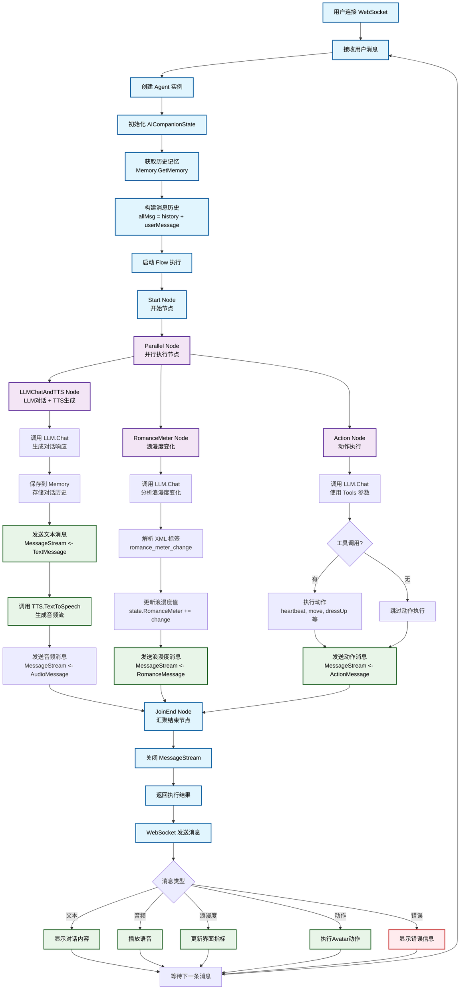

# AI Companions - AI 伴侣聊天系统

一个基于 Go 语言开发的智能 AI 伴侣系统，支持实时语音对话、文本聊天、视频交互等多种功能。

## ✨ 主要功能

- 🗣️ **实时语音对话** - 支持语音转文本（STT）和文本转语音（TTS）
- 💬 **智能文本聊天** - 基于大语言模型的对话系统
- 📹 **视频交互** - 支持摄像头实时视频流和屏幕捕获
- 🧠 **记忆管理** - 智能对话记忆压缩和管理
- 🔧 **工具集成** - 支持网络搜索、图像识别等多种工具
- ⚡ **实时通信** - 基于 WebSocket 的低延迟通信
- 📱 **响应式界面** - 现代化的 Web 用户界面

## 🏗️ 技术架构

### 后端技术栈
- **语言**: Go 1.24
- **框架**: Gin Web Framework
- **数据库**: MySQL / SQLite
- **实时通信**: WebSocket (Gorilla WebSocket)
- **容器化**: Docker + Docker Compose

### 前端技术栈
- **技术**: HTML5 + CSS3 + JavaScript
- **功能**: 实时视频流、音频处理、WebSocket 通信

### 核心模块
- **Agent 系统**: 智能代理和角色管理
- **Memory 系统**: 对话记忆管理和压缩
- **Tools 系统**: 外部工具集成框架
- **TTS/STT**: 语音处理模块
- **Flow 系统**: 工作流管理

## 📊 项目运行流程

以下是基于 Agent Flow 的完整运行流程图：



### 流程说明

**核心特点**：
- **并行处理**: LLM对话、浪漫度计算、动作执行三个节点并行运行，提高响应速度
- **状态管理**: 通过 `AICompanionState` 统一管理整个对话状态
- **消息流**: 使用 channel 实现异步消息传递
- **记忆管理**: 自动保存和检索对话历史

**关键节点**：
1. **LLMChatAndTTS Node**: 生成文本回复并转换为语音
2. **RomanceMeter Node**: 分析用户交互计算情感指标
3. **Action Node**: 根据对话内容执行具体动作

## 🚀 快速开始

### 环境要求

- Go 1.24+
- MySQL 8.0+ 或 SQLite 3
- Docker & Docker Compose（可选）

### 1. 克隆项目

```bash
git clone https://github.com/daodao97/ai-companions.git
cd ai-companions
```

### 2. 配置文件

复制配置模板并修改配置：

```bash
cp conf.yaml.exmaple conf.yaml
```

编辑 `conf.yaml` 文件，配置以下关键信息：

```yaml
# 数据库配置（选择其一）
database:
  - name: default
    driver: mysql
    dsn: root:root@tcp(localhost:3306)/ai_companion?charset=utf8mb4&parseTime=True&loc=Local
  # 或使用 SQLite
  - name: default
    driver: sqlite3
    dsn: ./companion.db

# TTS 配置（文本转语音）
tts:
  - name: default
    provider: minimax
    api_key: your_minimax_api_key
    group_id: your_group_id
    model: speech-02-hd

# STT 配置（语音转文本）
stt:
  - name: default
    provider: openai
    api_key: your_openai_api_key
    api_url: https://api.openai.com/v1
    model: whisper-1

# LLM 配置（大语言模型）
llm:
  - name: default
    provider: openai
    api_key: your_openai_api_key
    api_url: https://api.openai.com/v1
    model: gpt-4o-mini
```

### 3. 初始化数据库

#### 使用 MySQL
```bash
mysql -u root -p
CREATE DATABASE ai_companion CHARACTER SET utf8mb4 COLLATE utf8mb4_unicode_ci;
USE ai_companion;
SOURCE docs/db_mysql.sql;
```

#### 使用 SQLite
```bash
sqlite3 companion.db < docs/db_sqlite.sql
```

### 4. 安装依赖并运行

```bash
# 安装 Go 依赖
go mod tidy

# 编译并运行
go run main.go --bind 0.0.0.0:4001
```

### 5. 使用 Docker 部署（推荐）

```bash
# 使用 Docker Compose 一键部署
docker-compose up -d

# 或手动构建
docker build -t ai-companions .
docker run -p 4001:4001 -v $(pwd)/conf.yaml:/app/conf.yaml ai-companions
```

## 🌐 访问应用

启动成功后，在浏览器中访问：

```
http://localhost:4001
```

## 📖 使用指南

### 基本操作

1. **开始对话**: 打开浏览器访问应用，点击麦克风按钮开始语音对话
2. **文本聊天**: 在聊天框中输入文字与 AI 进行对话
3. **视频功能**: 点击摄像头按钮启用视频功能
4. **屏幕捕获**: 使用 Capture 按钮捕获屏幕内容

### 高级功能

#### 工具使用
AI 伴侣支持多种工具，包括：
- 网络搜索
- 图像识别和分析
- 时间查询
- 其他自定义工具

#### 记忆管理
系统会自动管理对话记忆，支持：
- 对话历史压缩
- 长期记忆存储
- 上下文理解

## 🔧 配置说明

### 数据库配置

支持 MySQL 和 SQLite 两种数据库：

```yaml
database:
  - name: default
    driver: mysql  # 或 sqlite3
    dsn: "连接字符串"
```

### AI 服务配置

#### 大语言模型 (LLM)
```yaml
llm:
  - name: default
    provider: openai
    api_key: "your_api_key"
    model: "gpt-4o-mini"
    temperature: 0.5
    max_tokens: 1000
```

#### 语音转文本 (STT)
```yaml
stt:
  - name: default
    provider: openai
    api_key: "your_api_key"
    model: "whisper-1"
```

#### 文本转语音 (TTS)
```yaml
tts:
  - name: default
    provider: minimax
    api_key: "your_api_key"
    model: "speech-02-hd"
    voice: "Chinese (Mandarin)_IntellectualGirl"
```

## 🏢 项目结构

```
ai-companions/
├── assets/                 # 前端资源文件
│   ├── index.html          # 主页面
│   └── static/             # 静态资源（CSS、JS）
├── internal/               # 核心业务逻辑
│   ├── admin/              # 管理接口
│   ├── api/                # API 接口
│   ├── auth/               # 认证模块
│   ├── character/          # 角色代理系统
│   ├── conf/               # 配置管理
│   ├── dao/                # 数据访问层
│   ├── pkg/                # 核心包
│   │   ├── xagent/         # 代理框架
│   │   ├── xflow/          # 工作流
│   │   ├── xllm/           # 大语言模型
│   │   ├── xmem/           # 记忆管理
│   │   ├── xstt/           # 语音转文本
│   │   ├── xtools/         # 工具系统
│   │   └── xtts/           # 文本转语音
│   └── wss/                # WebSocket 服务
├── docs/                   # 文档和数据库脚本
├── main.go                 # 程序入口
├── Dockerfile              # Docker 构建文件
├── compose.yaml            # Docker Compose 配置
└── conf.yaml.exmaple       # 配置文件模板
```

## 🔌 API 接口

### WebSocket 接口

- **连接地址**: `ws://localhost:4001/ws`
- **消息格式**: JSON
- **支持功能**: 实时文本聊天、语音传输、视频流

## 🛠️ 开发指南

### 添加新的工具

1. 在 `internal/pkg/xtools/` 目录下创建新工具
2. 实现 `ToolInterface` 接口
3. 在 Agent 中注册工具

### 扩展语音服务

1. 在相应的 TTS/STT 模块中添加新的提供商
2. 实现对应的接口
3. 更新配置文件

### 自定义 AI 角色

1. 修改 `internal/character/` 模块
2. 调整提示词和行为逻辑
3. 配置角色特定的参数

## 🐛 故障排除

### 常见问题

1. **数据库连接失败**
   - 检查数据库服务是否启动
   - 验证配置文件中的连接字符串

2. **API 密钥错误**
   - 确认 OpenAI/Minimax API 密钥正确
   - 检查 API 配额和权限

3. **WebSocket 连接失败**
   - 检查防火墙设置
   - 确认端口未被占用

4. **语音功能异常**
   - 检查浏览器麦克风权限
   - 确认 HTTPS 环境（某些浏览器要求）

### 日志查看

```bash
# 查看应用日志
docker-compose logs -f

# 或直接运行时查看
go run main.go --bind 0.0.0.0:4001
```

## 📄 许可证

MIT

## 🤝 贡献

欢迎提交 Issue 和 Pull Request 来改进这个项目！

## 📞 联系方式

如有问题或建议，请通过以下方式联系：

- GitHub Issues: [项目 Issues 页面]
- 邮箱: [您的邮箱]

---

**注意**: 首次使用前请确保已正确配置所有必要的 API 密钥和数据库连接。
